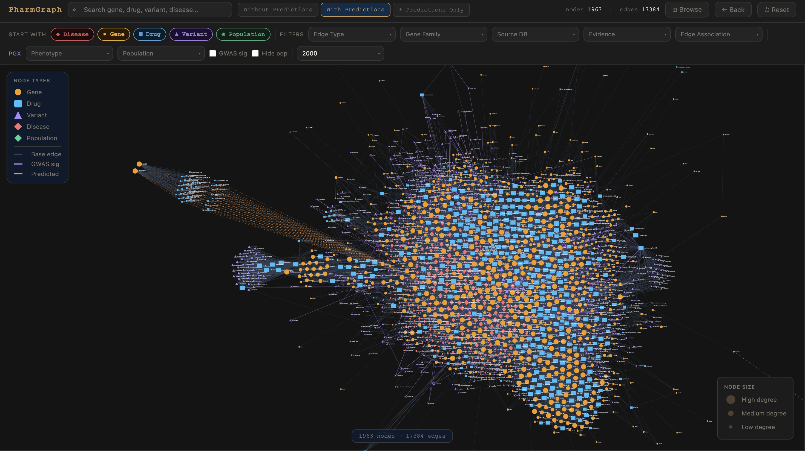
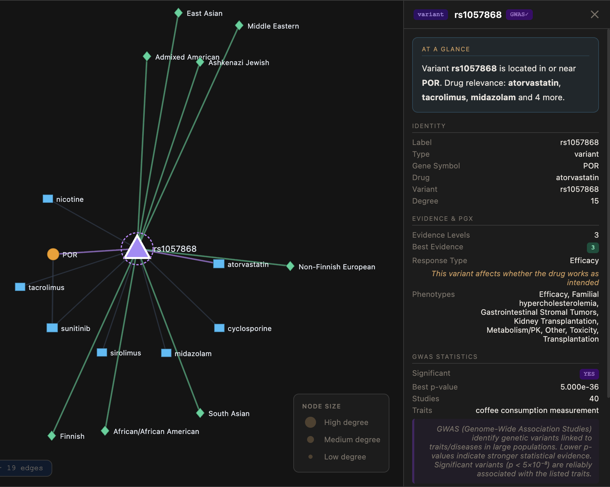
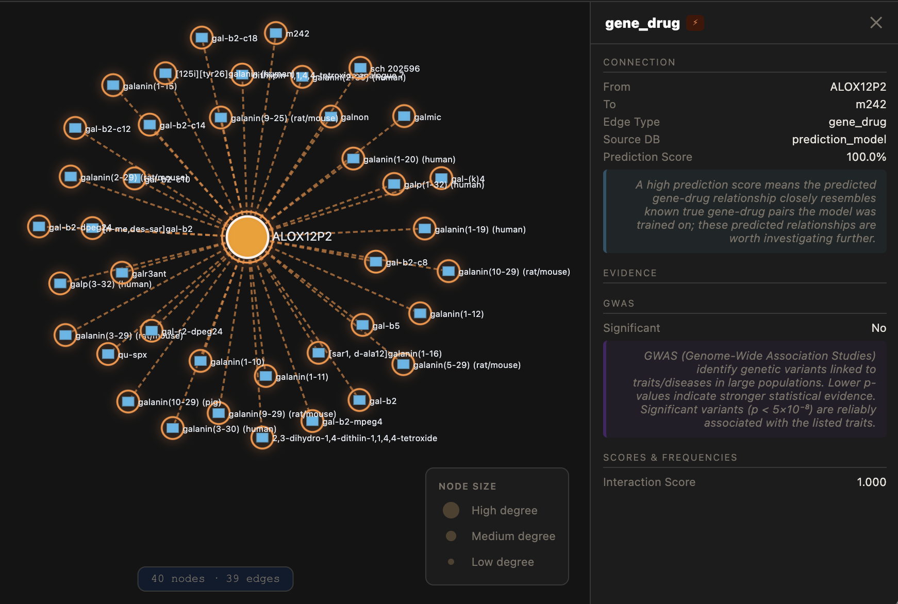

# PharmGraph  
A Pharmacogenomics Knowledge Graph & Clinical Analytics Platform 



## DESCRIPTION  

PharmGraph is an interactive pharmacogenomics (PGx) knowledge graph and analytics platform designed to unify drug–gene–variant–disease relationships into a single, queryable system. It supports precision medicine by enabling users to explore how genetic variation influences drug response across different populations.

Traditional pharmacogenomics resources store information across separate databases, such as variant repositories, drug–gene interaction datasets, and clinical guideline systems. This fragmentation makes integrated analysis difficult. PharmGraph addresses this limitation by combining multiple biomedical datasets into a unified heterogeneous knowledge graph.

The system integrates data from ClinVar (genetic variants), PharmGKB/ClinPGx (clinical annotations), DGIdb (drug–gene interactions).

PharmGraph enables:
- Population-aware insights into variants and genes
- Graph-based exploration of drug–gene–disease relationships
- Prediction of missing drug–gene interactions using machine learning

Overall, PharmGraph functions as both an exploratory tool and a predictive system for discovering clinically relevant relationships beyond curated databases.

## KEY FEATURES

- **Interactive Knowledge Graph**: Explore 50,000+ drug-gene-variant-disease-population relationships
- **Population-Aware Analysis**: View variant frequencies across 9 global populations
- **Multi-Layer Architecture**: Toggle between clinical data, modeled predictions, and combined views
- **Smart Filtering**: Filter by gene family, source database, evidence level, phenotype, population, relationship type, and GWAS significance
- **ML-Powered Predictions**: Discover novel drug-gene interactions predicted by graph neural networks
- **Clinical Context**: GWAS statistics, PGx annotations, and an integrated bioinformatics pipeline for computing variant frequencies 

## PREREQUISITES

| Requirement | Details |
|-------------|---------|
| **Git** | 2.30+ |
| **Python** | 3.8 or higher |
| **Browser** | Modern browser (Chrome, Firefox, Safari, Edge) |
| **Data Files** | Included in repository (`pharmgkb_graph.json`, `predicted_graph.json`, `base_graph.json`) |


## INSTALLATION  

### 1. Clone the repository
```bash
git clone https://github.com/venkat-aruna/pharmgraph.git
cd pharmgraph
```

### 2. Start local web server
```bash
python -m http.server 8000
```

### 3. Open in browser
Go to your local browser and navigate to: http://localhost:8000/

## USAGE

Once the server is running:

1. **Browse by Entity Type**: Click Disease, Gene, Drug, Variant, or Population on the landing page
2. **Search**: Type a gene (e.g., "CYP2D6"), drug (e.g., "Warfarin"), or variant (e.g., "rs4149056") or just explore
3. **Explore Relationships**: Click on edges for relationship details, evidence, and interaction scores
4. **Explore Relationships**: Click on nodes for identity information, PGx evidence, and GWAS statistics
5. **Filter the Graph**: Use the top filter bar to refine by gene family, source database, evidence level, phenotype, population, and relationship type
6. **Switch Layers**: Toggle between clinical data, modeled predictions, and combined views

## SCREENSHOTS

### Population Analysis

*Variant frequencies across 9 global populations*

### Prediction Layer

*Novel drug-gene interactions predicted by machine learning*


## RAW DATA
If you are interested in our raw datasets, you can find them here:
1. **ClinPGX**: https://www.clinpgx.org/downloads
  - This includes ClinicalVariants.zip, SummaryAnnotations.zip, and relationships.zip
3. **DGIdb**: https://dgidb.org/downloads
  - This includes interactions.tsv
4. **HGNC**: https://www.genenames.org/download/
  - This includes hgnc_complete_set.txt
5. **HGNC Gene Families**: https://www.genenames.org/download/gene-groups/
  - This includes hierarchy.csv
6. **ClinVar**: https://ftp.ncbi.nlm.nih.gov/pub/clinvar/vcf_GRCh38/
  - This includes clinvar.vcf.gz


## FUTURE IMPROVEMENTS

- [ ] Expand population coverage to include more underrepresented populations 
- [ ] Expand to variant-disease edges
- [ ] Improve ML prediction accuracy and add drug-drug interaction predictions
- [ ] Add export to CSV/JSON functionality
- [ ] Enhance clinical decision-support capabilities
- [ ] Increase dataset completeness and graph connectivity
